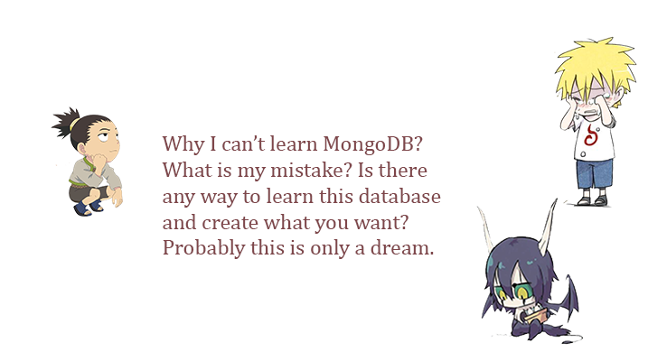

### learn-mongodb
* [introduction](md/)
* [Installation](md/INSTALL.md)
* [First Program](md/FIRST_PROGRAM.md)
* [Tasks](md/TASKS.md)
* [Examples](md/EXAMPLES.md)
* [Questions](md/QUESTIONS.md)
* [Methods](md/METHODS.md)

### Short Alogithm:
1. [Download MongoDB](https://www.mongodb.com/download-center?jmp=nav#community)
1. Install MongoDB(Dupa instalare trebuie sa adaugi folder `/bin in PATH.`)
1. Scrie in consolă `mkdir C:/data/db`. (Nu sunt sigur dacă trebuie dreptul de Administrator. Probabil ca nu.)
1. path [see here](md/PATH.md)
1. Check if MongoDB is installed. `mongod --help` and `mongo --version`
1. mkdir write_your_project_name
1. cd write_your_project_name
1. npm init
1. npm install mongodb
1. go to see in file server.js

### Commands in MongoDB:
* `mongo` : Сначала запускай команду mongod в терминале а потом уже пищи mongo. Здесь можно раотать с MongoDB.
* `mongod` : Он обрабатывает запросы данных, управляет доступом к данным и выполняет фоновые операции управления.
* `mongose` : 
* `mongosh` : must download and install
* `BSON` : 

### Exetern Links :
* [Stack Overflow](https://stackoverflow.com/tags/mongodb/info)
* [mongodb-tutorial-w3schools](https://www.w3schools.blog/mongodb-tutorial)
* [Mongoose](https://mongoosejs.com/)
* [w3schools](https://www.w3schools.com/nodejs/nodejs_mongodb_create_db.asp)
* [?](https://docs.mongodb.com/drivers/node/current/)
* mongoose