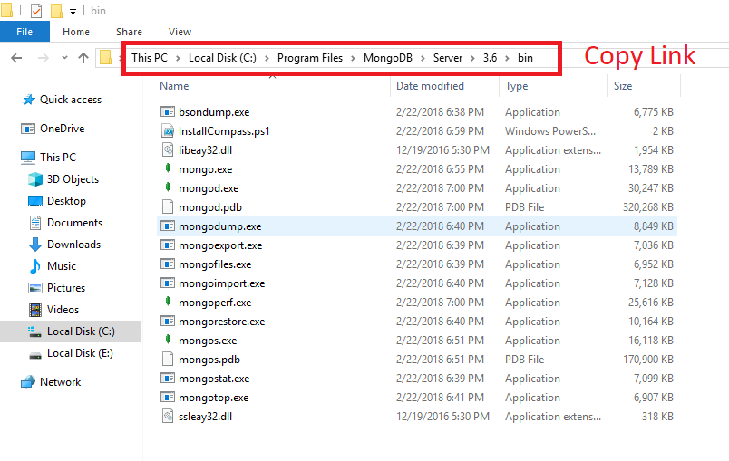
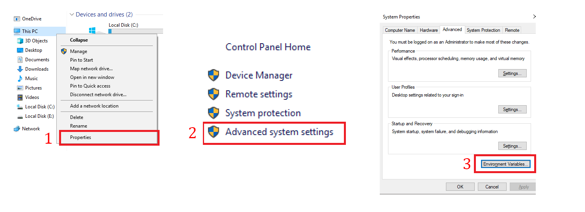
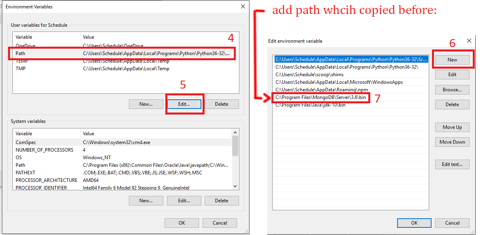

### MongoDB Settings Windows 10
Before you start working with mongodb, you need to specify the path to the environment variables. I'll show you how to do this. Get in `in my computer`. and press right click on the icon(fig. 1). After clicking on the `property` you will see in the upper left corner `Advanced system settings`(fig. 2). Now press `environment variables`.

After installed mongo the most important thing is must copy path. If installed mongo default:
 `C:\Program Files\MongoDB\Server\3.6\bin`

* here is some text

* try again

* and will appear a window

* and open console, put `mkdir c:/data/db`